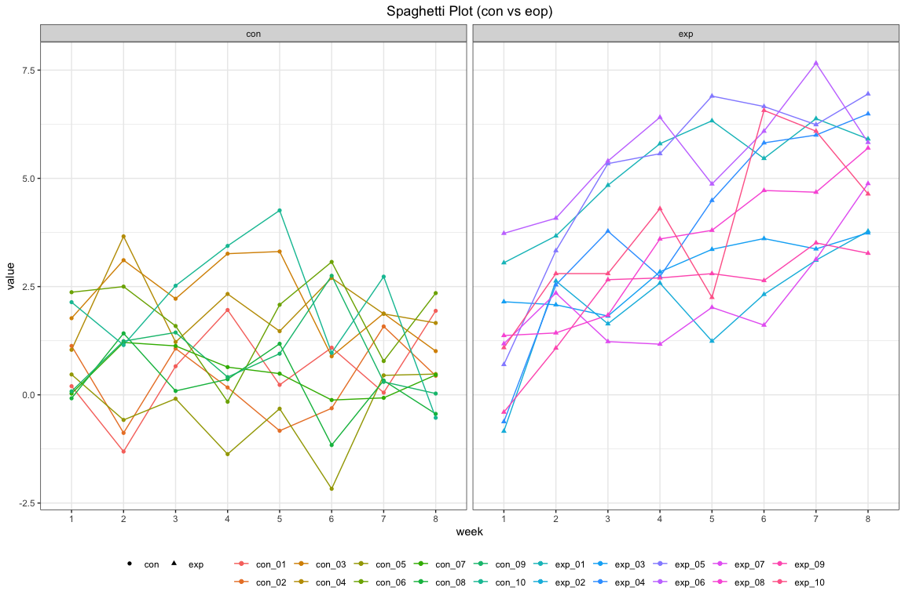

HW5
================

Problem 1
---------

``` r
set.seed(10)

iris_with_missing = iris %>% 
  map_df(~replace(.x, sample(1:150, 20), NA)) %>%
  mutate(Species = as.character(Species)) %>% janitor::clean_names()

rep_mis = function(x){
  if(is.character(x)){
    col = replace(x, is.na(x), "virginica")
  }else if(is.numeric(x)){
    col = replace(x, is.na(x), round(mean(x, na.rm = T),1))
  }
  col
}

iris = map(iris_with_missing, rep_mis)
iris_df = data.frame(iris)
knitr::kable(head(iris_df))
```

|  sepal\_length|  sepal\_width|  petal\_length|  petal\_width| species |
|--------------:|-------------:|--------------:|-------------:|:--------|
|            5.1|           3.5|            1.4|           0.2| setosa  |
|            4.9|           3.0|            1.4|           0.2| setosa  |
|            4.7|           3.2|            1.3|           0.2| setosa  |
|            4.6|           3.1|            1.5|           1.2| setosa  |
|            5.0|           3.6|            1.4|           0.2| setosa  |
|            5.4|           3.9|            1.7|           0.4| setosa  |

Problem 2
---------

``` r
df = tibble(subject_id = list.files("./data/"))
read_data = function(x){
  path = str_c("./data/", x)
  data = read_csv(path)
  data
}

df = cbind(df, map(df[[1]], read_data) %>% bind_rows())
df = df %>% separate(subject_id, into = c("arm", "subject_id"), sep = "\\_") %>% separate(subject_id, into = c("subject_id", "delete")) %>% select(-delete)
knitr::kable(df)
```

| arm | subject\_id |  week\_1|  week\_2|  week\_3|  week\_4|  week\_5|  week\_6|  week\_7|  week\_8|
|:----|:------------|--------:|--------:|--------:|--------:|--------:|--------:|--------:|--------:|
| con | 01          |     0.20|    -1.31|     0.66|     1.96|     0.23|     1.09|     0.05|     1.94|
| con | 02          |     1.13|    -0.88|     1.07|     0.17|    -0.83|    -0.31|     1.58|     0.44|
| con | 03          |     1.77|     3.11|     2.22|     3.26|     3.31|     0.89|     1.88|     1.01|
| con | 04          |     1.04|     3.66|     1.22|     2.33|     1.47|     2.70|     1.87|     1.66|
| con | 05          |     0.47|    -0.58|    -0.09|    -1.37|    -0.32|    -2.17|     0.45|     0.48|
| con | 06          |     2.37|     2.50|     1.59|    -0.16|     2.08|     3.07|     0.78|     2.35|
| con | 07          |     0.03|     1.21|     1.13|     0.64|     0.49|    -0.12|    -0.07|     0.46|
| con | 08          |    -0.08|     1.42|     0.09|     0.36|     1.18|    -1.16|     0.33|    -0.44|
| con | 09          |     0.08|     1.24|     1.44|     0.41|     0.95|     2.75|     0.30|     0.03|
| con | 10          |     2.14|     1.15|     2.52|     3.44|     4.26|     0.97|     2.73|    -0.53|
| exp | 01          |     3.05|     3.67|     4.84|     5.80|     6.33|     5.46|     6.38|     5.91|
| exp | 02          |    -0.84|     2.63|     1.64|     2.58|     1.24|     2.32|     3.11|     3.78|
| exp | 03          |     2.15|     2.08|     1.82|     2.84|     3.36|     3.61|     3.37|     3.74|
| exp | 04          |    -0.62|     2.54|     3.78|     2.73|     4.49|     5.82|     6.00|     6.49|
| exp | 05          |     0.70|     3.33|     5.34|     5.57|     6.90|     6.66|     6.24|     6.95|
| exp | 06          |     3.73|     4.08|     5.40|     6.41|     4.87|     6.09|     7.66|     5.83|
| exp | 07          |     1.18|     2.35|     1.23|     1.17|     2.02|     1.61|     3.13|     4.88|
| exp | 08          |     1.37|     1.43|     1.84|     3.60|     3.80|     4.72|     4.68|     5.70|
| exp | 09          |    -0.40|     1.08|     2.66|     2.70|     2.80|     2.64|     3.51|     3.27|
| exp | 10          |     1.09|     2.80|     2.80|     4.30|     2.25|     6.57|     6.09|     4.64|

``` r
df %>% pivot_longer(week_1:week_8, names_to = "week", values_to = "value") %>% mutate(id = str_c(arm, "_" ,subject_id), week = factor(str_remove(week, "week_"))) %>% ggplot(aes(x=week, y = value, group = id)) + geom_line(aes(color = id)) + facet_grid(.~arm) + theme_bw() + theme(legend.position = "bottom", plot.title = element_text(hjust = 0.5), legend.title = element_blank()) + labs(
  title = "Spaghetti Plot (con vs eop)"
) + guides(colour = guide_legend(nrow = 2)) + geom_point(aes(color = id, shape = arm))
```


