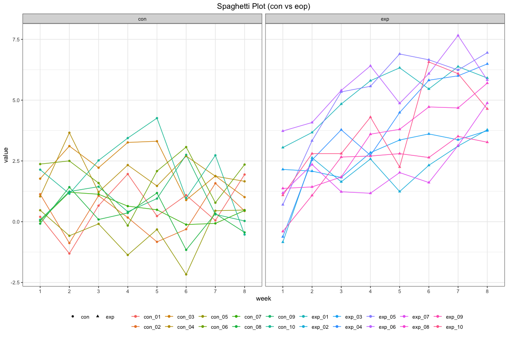
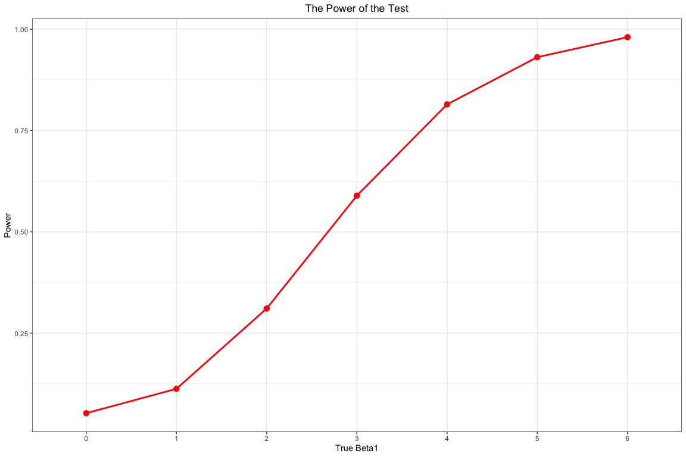
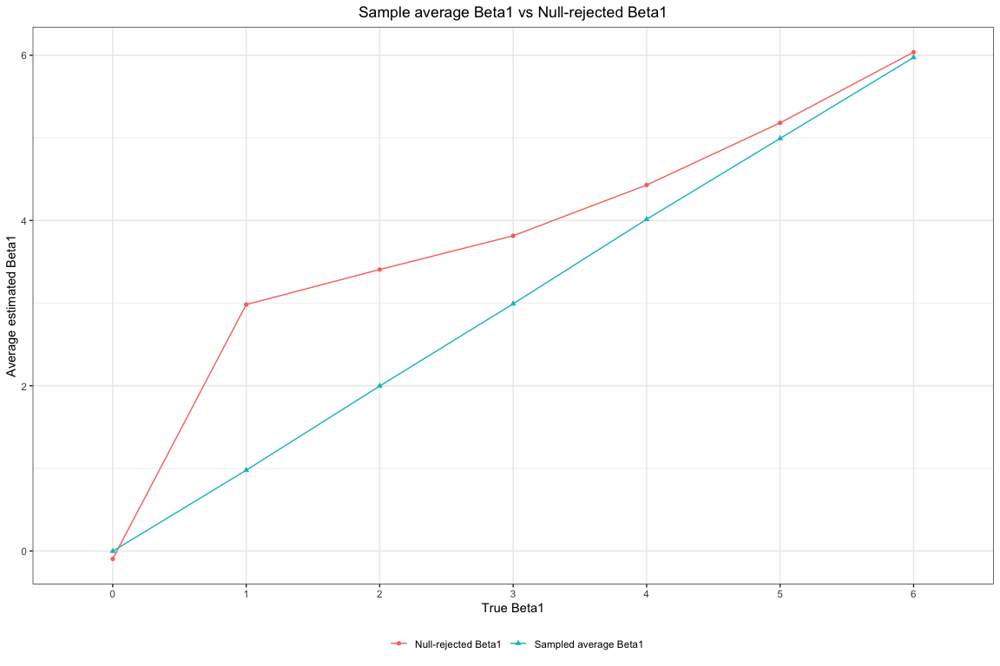

HW5
================
Xinyu Shen xs2384

Problem 1
---------

``` r
set.seed(10)

iris_with_missing = iris %>% 
  map_df(~replace(.x, sample(1:150, 20), NA)) %>%
  mutate(Species = as.character(Species)) %>% janitor::clean_names()

rep_mis = function(x){
  if(is.character(x)){
    col = replace(x, is.na(x), "virginica")
  }else if(is.numeric(x)){
    col = replace(x, is.na(x), round(mean(x, na.rm = T),1))
  }
  col
}

iris = map(iris_with_missing, rep_mis)
iris_df = data.frame(iris)
knitr::kable(head(iris_df))
```

|  sepal\_length|  sepal\_width|  petal\_length|  petal\_width| species |
|--------------:|-------------:|--------------:|-------------:|:--------|
|            5.1|           3.5|            1.4|           0.2| setosa  |
|            4.9|           3.0|            1.4|           0.2| setosa  |
|            4.7|           3.2|            1.3|           0.2| setosa  |
|            4.6|           3.1|            1.5|           1.2| setosa  |
|            5.0|           3.6|            1.4|           0.2| setosa  |
|            5.4|           3.9|            1.7|           0.4| setosa  |

Problem 2
---------

### Clean and tidy the data

``` r
df = tibble(subject_id = list.files("./data/"))
read_data = function(x){
  path = str_c("./data/", x)
  data = read_csv(path)
  data
}

df = cbind(df, map(df[[1]], read_data) %>% bind_rows())
df = df %>% separate(subject_id, into = c("arm", "subject_id"), sep = "\\_") %>% separate(subject_id, into = c("subject_id", "delete")) %>% select(-delete) %>% pivot_longer(week_1:week_8, names_to = "week", values_to = "value") %>% mutate(id = str_c(arm, "_" ,subject_id), week = factor(str_remove(week, "week_"))) 
knitr::kable(df)
```

| arm | subject\_id | week |  value| id      |
|:----|:------------|:-----|------:|:--------|
| con | 01          | 1    |   0.20| con\_01 |
| con | 01          | 2    |  -1.31| con\_01 |
| con | 01          | 3    |   0.66| con\_01 |
| con | 01          | 4    |   1.96| con\_01 |
| con | 01          | 5    |   0.23| con\_01 |
| con | 01          | 6    |   1.09| con\_01 |
| con | 01          | 7    |   0.05| con\_01 |
| con | 01          | 8    |   1.94| con\_01 |
| con | 02          | 1    |   1.13| con\_02 |
| con | 02          | 2    |  -0.88| con\_02 |
| con | 02          | 3    |   1.07| con\_02 |
| con | 02          | 4    |   0.17| con\_02 |
| con | 02          | 5    |  -0.83| con\_02 |
| con | 02          | 6    |  -0.31| con\_02 |
| con | 02          | 7    |   1.58| con\_02 |
| con | 02          | 8    |   0.44| con\_02 |
| con | 03          | 1    |   1.77| con\_03 |
| con | 03          | 2    |   3.11| con\_03 |
| con | 03          | 3    |   2.22| con\_03 |
| con | 03          | 4    |   3.26| con\_03 |
| con | 03          | 5    |   3.31| con\_03 |
| con | 03          | 6    |   0.89| con\_03 |
| con | 03          | 7    |   1.88| con\_03 |
| con | 03          | 8    |   1.01| con\_03 |
| con | 04          | 1    |   1.04| con\_04 |
| con | 04          | 2    |   3.66| con\_04 |
| con | 04          | 3    |   1.22| con\_04 |
| con | 04          | 4    |   2.33| con\_04 |
| con | 04          | 5    |   1.47| con\_04 |
| con | 04          | 6    |   2.70| con\_04 |
| con | 04          | 7    |   1.87| con\_04 |
| con | 04          | 8    |   1.66| con\_04 |
| con | 05          | 1    |   0.47| con\_05 |
| con | 05          | 2    |  -0.58| con\_05 |
| con | 05          | 3    |  -0.09| con\_05 |
| con | 05          | 4    |  -1.37| con\_05 |
| con | 05          | 5    |  -0.32| con\_05 |
| con | 05          | 6    |  -2.17| con\_05 |
| con | 05          | 7    |   0.45| con\_05 |
| con | 05          | 8    |   0.48| con\_05 |
| con | 06          | 1    |   2.37| con\_06 |
| con | 06          | 2    |   2.50| con\_06 |
| con | 06          | 3    |   1.59| con\_06 |
| con | 06          | 4    |  -0.16| con\_06 |
| con | 06          | 5    |   2.08| con\_06 |
| con | 06          | 6    |   3.07| con\_06 |
| con | 06          | 7    |   0.78| con\_06 |
| con | 06          | 8    |   2.35| con\_06 |
| con | 07          | 1    |   0.03| con\_07 |
| con | 07          | 2    |   1.21| con\_07 |
| con | 07          | 3    |   1.13| con\_07 |
| con | 07          | 4    |   0.64| con\_07 |
| con | 07          | 5    |   0.49| con\_07 |
| con | 07          | 6    |  -0.12| con\_07 |
| con | 07          | 7    |  -0.07| con\_07 |
| con | 07          | 8    |   0.46| con\_07 |
| con | 08          | 1    |  -0.08| con\_08 |
| con | 08          | 2    |   1.42| con\_08 |
| con | 08          | 3    |   0.09| con\_08 |
| con | 08          | 4    |   0.36| con\_08 |
| con | 08          | 5    |   1.18| con\_08 |
| con | 08          | 6    |  -1.16| con\_08 |
| con | 08          | 7    |   0.33| con\_08 |
| con | 08          | 8    |  -0.44| con\_08 |
| con | 09          | 1    |   0.08| con\_09 |
| con | 09          | 2    |   1.24| con\_09 |
| con | 09          | 3    |   1.44| con\_09 |
| con | 09          | 4    |   0.41| con\_09 |
| con | 09          | 5    |   0.95| con\_09 |
| con | 09          | 6    |   2.75| con\_09 |
| con | 09          | 7    |   0.30| con\_09 |
| con | 09          | 8    |   0.03| con\_09 |
| con | 10          | 1    |   2.14| con\_10 |
| con | 10          | 2    |   1.15| con\_10 |
| con | 10          | 3    |   2.52| con\_10 |
| con | 10          | 4    |   3.44| con\_10 |
| con | 10          | 5    |   4.26| con\_10 |
| con | 10          | 6    |   0.97| con\_10 |
| con | 10          | 7    |   2.73| con\_10 |
| con | 10          | 8    |  -0.53| con\_10 |
| exp | 01          | 1    |   3.05| exp\_01 |
| exp | 01          | 2    |   3.67| exp\_01 |
| exp | 01          | 3    |   4.84| exp\_01 |
| exp | 01          | 4    |   5.80| exp\_01 |
| exp | 01          | 5    |   6.33| exp\_01 |
| exp | 01          | 6    |   5.46| exp\_01 |
| exp | 01          | 7    |   6.38| exp\_01 |
| exp | 01          | 8    |   5.91| exp\_01 |
| exp | 02          | 1    |  -0.84| exp\_02 |
| exp | 02          | 2    |   2.63| exp\_02 |
| exp | 02          | 3    |   1.64| exp\_02 |
| exp | 02          | 4    |   2.58| exp\_02 |
| exp | 02          | 5    |   1.24| exp\_02 |
| exp | 02          | 6    |   2.32| exp\_02 |
| exp | 02          | 7    |   3.11| exp\_02 |
| exp | 02          | 8    |   3.78| exp\_02 |
| exp | 03          | 1    |   2.15| exp\_03 |
| exp | 03          | 2    |   2.08| exp\_03 |
| exp | 03          | 3    |   1.82| exp\_03 |
| exp | 03          | 4    |   2.84| exp\_03 |
| exp | 03          | 5    |   3.36| exp\_03 |
| exp | 03          | 6    |   3.61| exp\_03 |
| exp | 03          | 7    |   3.37| exp\_03 |
| exp | 03          | 8    |   3.74| exp\_03 |
| exp | 04          | 1    |  -0.62| exp\_04 |
| exp | 04          | 2    |   2.54| exp\_04 |
| exp | 04          | 3    |   3.78| exp\_04 |
| exp | 04          | 4    |   2.73| exp\_04 |
| exp | 04          | 5    |   4.49| exp\_04 |
| exp | 04          | 6    |   5.82| exp\_04 |
| exp | 04          | 7    |   6.00| exp\_04 |
| exp | 04          | 8    |   6.49| exp\_04 |
| exp | 05          | 1    |   0.70| exp\_05 |
| exp | 05          | 2    |   3.33| exp\_05 |
| exp | 05          | 3    |   5.34| exp\_05 |
| exp | 05          | 4    |   5.57| exp\_05 |
| exp | 05          | 5    |   6.90| exp\_05 |
| exp | 05          | 6    |   6.66| exp\_05 |
| exp | 05          | 7    |   6.24| exp\_05 |
| exp | 05          | 8    |   6.95| exp\_05 |
| exp | 06          | 1    |   3.73| exp\_06 |
| exp | 06          | 2    |   4.08| exp\_06 |
| exp | 06          | 3    |   5.40| exp\_06 |
| exp | 06          | 4    |   6.41| exp\_06 |
| exp | 06          | 5    |   4.87| exp\_06 |
| exp | 06          | 6    |   6.09| exp\_06 |
| exp | 06          | 7    |   7.66| exp\_06 |
| exp | 06          | 8    |   5.83| exp\_06 |
| exp | 07          | 1    |   1.18| exp\_07 |
| exp | 07          | 2    |   2.35| exp\_07 |
| exp | 07          | 3    |   1.23| exp\_07 |
| exp | 07          | 4    |   1.17| exp\_07 |
| exp | 07          | 5    |   2.02| exp\_07 |
| exp | 07          | 6    |   1.61| exp\_07 |
| exp | 07          | 7    |   3.13| exp\_07 |
| exp | 07          | 8    |   4.88| exp\_07 |
| exp | 08          | 1    |   1.37| exp\_08 |
| exp | 08          | 2    |   1.43| exp\_08 |
| exp | 08          | 3    |   1.84| exp\_08 |
| exp | 08          | 4    |   3.60| exp\_08 |
| exp | 08          | 5    |   3.80| exp\_08 |
| exp | 08          | 6    |   4.72| exp\_08 |
| exp | 08          | 7    |   4.68| exp\_08 |
| exp | 08          | 8    |   5.70| exp\_08 |
| exp | 09          | 1    |  -0.40| exp\_09 |
| exp | 09          | 2    |   1.08| exp\_09 |
| exp | 09          | 3    |   2.66| exp\_09 |
| exp | 09          | 4    |   2.70| exp\_09 |
| exp | 09          | 5    |   2.80| exp\_09 |
| exp | 09          | 6    |   2.64| exp\_09 |
| exp | 09          | 7    |   3.51| exp\_09 |
| exp | 09          | 8    |   3.27| exp\_09 |
| exp | 10          | 1    |   1.09| exp\_10 |
| exp | 10          | 2    |   2.80| exp\_10 |
| exp | 10          | 3    |   2.80| exp\_10 |
| exp | 10          | 4    |   4.30| exp\_10 |
| exp | 10          | 5    |   2.25| exp\_10 |
| exp | 10          | 6    |   6.57| exp\_10 |
| exp | 10          | 7    |   6.09| exp\_10 |
| exp | 10          | 8    |   4.64| exp\_10 |

### Visualize the result

``` r
df %>% ggplot(aes(x=week, y = value, group = id)) + geom_line(aes(color = id)) + facet_grid(.~arm) + theme_bw() + theme(legend.position = "bottom", plot.title = element_text(hjust = 0.5), legend.title = element_blank()) + labs(
  title = "Spaghetti Plot (con vs eop)"
) + guides(colour = guide_legend(nrow = 2)) + geom_point(aes(color = id, shape = arm))
```



In the control arm, the value did not change a lot from week 1 to week 8, although there is fluctuation through these weeks. In the experimental arm, the values have increasing trend from week 1 and week 8. We can see that control arm did not have explicitly trend to increase or decrease whereas experimental arm has the trend of increasing.

Problem 3
---------

### Simulate the simple linear regression model

``` r
slr = function(n=30, beta0=2, beta1){
 sim_data = tibble(x = rnorm(n,0,1),
  y = beta0 + beta1*x + rnorm(n,0,sqrt(50))
 )
  
  ls_fit = lm(y~x, data = sim_data )
  broom::tidy(ls_fit)
}


sim_results_0 = rerun(10000, slr(beta1 = 0)) %>% bind_rows()

for(i in 1:6){
  assign(str_c("sim_results", "_", i), rerun(10000, slr(beta1 = i)) %>% bind_rows())
}

simresult = vector("list", 7)
for(i in 1:7){
  simresult[[i]] = str_c("sim_results", "_", i-1)
}
```

### Visualize the power of test

``` r
sim_power = list()
for(i in 0:6){
  sim_power[as.character(i)] = nrow(filter(.data = eval(parse(text=simresult[[i+1]])), term == "x" & p.value < 0.05))/nrow(filter(eval(parse(text = simresult[[i+1]])), term == "x"))
}


data.frame(sim_power) %>%  pivot_longer(X0:X6, names_to = "beta1", values_to = "power") %>% mutate(
  beta1 = str_remove(beta1, "X")
) %>% ggplot(aes(x = beta1, y = power, group = 1)) + geom_line(color = "red", size = 1) + geom_point(color = "red", size = 3) + theme_bw() + labs(title = "The Power of the Test", x = "True Beta1", y = "Power") + theme(plot.title = element_text(hjust = 0.5))
```



From the above plot, with the true beta1 value increased from 0 to 6, the power of test increased from about 0 to 1. The slope is positive so the there is an increasing relationship between beta1 and power of test. We can say that bigger beta1 has stronger power of test.

### Visualize the average estimate of beta1 for all samples and for samples which reject the null hypothesis

``` r
ave_est = list()

for (i in 0:6) {
  ave_est[as.character(i)] = eval(parse(text = simresult[[i+1]])) %>% filter(term == "x") %>% pull(estimate) %>% mean()
  
}

ave_est_null = list()

for (i in 0:6) {
  ave_est_null[as.character(i)] = eval(parse(text = simresult[[i+1]])) %>% filter(term == "x"& p.value < 0.05) %>% pull(estimate) %>% mean()
  
}

null = data.frame(ave_est_null) %>% pivot_longer(X0:X6, names_to = "beta1", values_to = "estimate") %>% mutate(
  beta1 = str_remove(beta1, "X"),
  reject = "Null-rejected Beta1"
) 

ave = data.frame(ave_est) %>% pivot_longer(X0:X6, names_to = "beta1", values_to = "estimate") %>% mutate(
  beta1 = str_remove(beta1, "X"),
  reject = "Sampled average Beta1"
) 

rbind(null, ave) %>% ggplot(aes(x = beta1, y = estimate, group = reject)) + geom_line(aes(color = reject)) + geom_point(aes(color = reject, shape = reject)) + theme_bw() + labs(title = "Sample average Beta1 vs Null-rejected Beta1", x = "True Beta1", y = "Average estimated Beta1") + theme(plot.title = element_text(hjust = 0.5), legend.position = "bottom", legend.title = element_blank())
```



From the above plot, we can see that the null-rejected average estimated beta1 is higher than and not approximately equal to true . However, with the true beta1 incresed, the null-rejected beta1 is graduately close to sample beta1, which is approximately equal to true beta1. Since we reject the null hypothesis which states that the beta1 equals to 0, the small values for estimated beta1 was rejected from null-rejected beta1. Thus, for smaller true beta1, the rejection of small value in estimated beata1 will actually make it higher than the true value.
